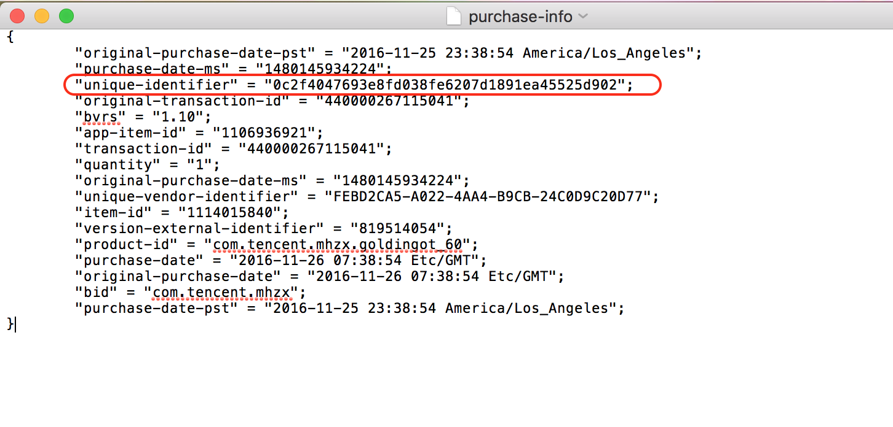
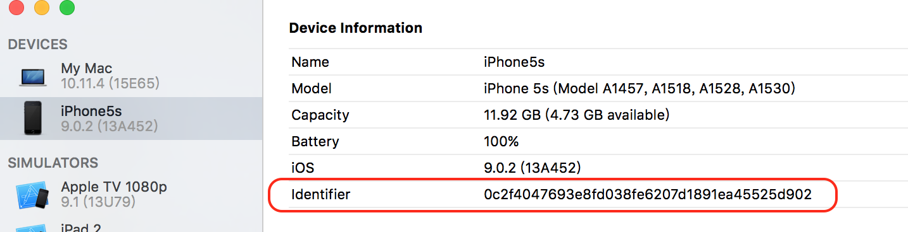

# GetUDIDFromStoreKit
#### Get UDID(Unique Device Identifier) From StoreKit

##### 1. After iOS5, Developer can't use "uniqueIdentifier" like this "[UIDevice currentDevice] uniqueIdentifier]". The property is deprecated, and replaced by "identifierForVendor". Also we can use OpenUDID or SecureUDID, working with NSUserDefaults and Keychain. Now, if your App has some purchase item using StoreKit, we can find UDID from receipt

```objc
NS_CLASS_AVAILABLE_IOS(2_0) @interface UIDevice : NSObject 
...
@property(nonatomic,readonly,retain) NSString *uniqueIdentifier  NS_DEPRECATED_IOS(2_0, 5_0);// a string unique to each device based on various hardware info.
@property(nonatomic,readonly,retain) NSUUID *identifierForVendor NS_AVAILABLE_IOS(6_0);// a UUID that may be used to uniquely identify the device, same across apps from a single vendor.
....
@end
```

##### 2. In SKPaymentQueue’s delegate we can get "Receipt Data" from SKPaymentTransaction in state of SKPaymentTransactionStatePurchased.

```objc
- (void)paymentQueue:(SKPaymentQueue *)queue updatedTransactions:(NSArray<SKPaymentTransaction *> *)transactions{
    
    for (SKPaymentTransaction *transaction in transactions) {
        
        if (SKPaymentTransactionStatePurchased == transaction.transactionState) {
            NSData *receiptData = transaction.transactionReceipt;
            NSString *UDID = [self UDIDFromReceiptData:receiptData];
            NSLog(@"UDID:%@",UDID);
            
        }
    }
    
}
```

##### 3. The "Receipt Data" will send to Apple and verify the purchase is success. Actually, the "Receipt Data" is a old-style property list, see below and in file "transactionReceipt".

```objc
{
	"signature" = "A0L7FxPOeP0IPagwE+Cuxm1MpVf8MjTto+7FDbTNA9HxOSVU+XzQQkpuqwTIC9sdJLCavKwzPjfYI/8fWEbRfWbTPGPzHdVMtu5rXZ8OIJsQ+/rHkLGYOOw3vjcvj7VMnFVNCeaFjc+/UydPW2qmIq8rgRo+5/HdfYLXSZ/2wSeqxeFTxYRjD8trGk29jj9Dpji70c6QqBQGhOgEpwG9aJbIuaGvp99q5D9VB9TIZU3aHSpMki05Gj6FAzYN0o1BddWuPGywwW+trAjhrZXeARJsSp7LSO1KEeco3AbNNwMvtNJ/jKwp/2SuRYH/mmtOyd1uo4qQBPUXhIwURpmgGCQAAAWAMIIFfDCCBGSgAwIBAgIIDutXh+eeCY0wDQYJKoZIhvcNAQEFBQAwgZYxCzAJBgNVBAYTAlVTMRMwEQYDVQQKDApBcHBsZSBJbmMuMSwwKgYDVQQLDCNBcHBsZSBXb3JsZHdpZGUgRGV2ZWxvcGVyIFJlbGF0aW9uczFEMEIGA1UEAww7QXBwbGUgV29ybGR3aWRlIERldmVsb3BlciBSZWxhdGlvbnMgQ2VydGlmaWNhdGlvbiBBdXRob3JpdHkwHhcNMTUxMTEzMDIxNTA5WhcNMjMwMjA3MjE0ODQ3WjCBiTE3MDUGA1UEAwwuTWFjIEFwcCBTdG9yZSBhbmQgaVR1bmVzIFN0b3JlIFJlY2VpcHQgU2lnbmluZzEsMCoGA1UECwwjQXBwbGUgV29ybGR3aWRlIERldmVsb3BlciBSZWxhdGlvbnMxEzARBgNVBAoMCkFwcGxlIEluYy4xCzAJBgNVBAYTAlVTMIIBIjANBgkqhkiG9w0BAQEFAAOCAQ8AMIIBCgKCAQEApc+B/SWigVvWh+0j2jMcjuIjwKXEJss9xp/sSg1Vhv+kAteXyjlUbX1/slQYncQsUnGOZHuCzom6SdYI5bSIcc8/W0YuxsQduAOpWKIEPiF41du30I4SjYNMWypoN5PC8r0exNKhDEpYUqsS4+3dH5gVkDUtwswSyo1IgfdYeFRr6IwxNh9KBgxHVPM3kLiykol9X6SFSuHAnOC6pLuCl2P0K5PB/T5vysH1PKmPUhrAJQp2Dt7+mf7/wmv1W16sc1FJCFaJzEOQzI6BAtCgl7ZcsaFpaYeQEGgmJjm4HRBzsApdxXPQ33Y72C3ZiB7j7AfP4o7Q0/omVYHv4gNJIwIDAQABo4IB1zCCAdMwPwYIKwYBBQUHAQEEMzAxMC8GCCsGAQUFBzABhiNodHRwOi8vb2NzcC5hcHBsZS5jb20vb2NzcDAzLXd3ZHIwNDAdBgNVHQ4EFgQUkaSc/MR2t5+givRN9Y82Xe0rBIUwDAYDVR0TAQH/BAIwADAfBgNVHSMEGDAWgBSIJxcJqbYYYIvs67r2R1nFUlSjtzCCAR4GA1UdIASCARUwggERMIIBDQYKKoZIhvdjZAUGATCB/jCBwwYIKwYBBQUHAgIwgbYMgbNSZWxpYW5jZSBvbiB0aGlzIGNlcnRpZmljYXRlIGJ5IGFueSBwYXJ0eSBhc3N1bWVzIGFjY2VwdGFuY2Ugb2YgdGhlIHRoZW4gYXBwbGljYWJsZSBzdGFuZGFyZCB0ZXJtcyBhbmQgY29uZGl0aW9ucyBvZiB1c2UsIGNlcnRpZmljYXRlIHBvbGljeSBhbmQgY2VydGlmaWNhdGlvbiBwcmFjdGljZSBzdGF0ZW1lbnRzLjA2BggrBgEFBQcCARYqaHR0cDovL3d3dy5hcHBsZS5jb20vY2VydGlmaWNhdGVhdXRob3JpdHkvMA4GA1UdDwEB/wQEAwIHgDAQBgoqhkiG92NkBgsBBAIFADANBgkqhkiG9w0BAQUFAAOCAQEADaYb0y4941srB25ClmzT6IxDMIJf4FzRjb69D70a/CWS24yFw4BZ3+Pi1y4FFKwN27a4/vw1LnzLrRdrjn8f5He5sWeVtBNephmGdvhaIJXnY4wPc/zo7cYfrpn4ZUhcoOAoOsAQNy25oAQ5H3O5yAX98t5/GioqbisB/KAgXNnrfSemM/j1mOC+RNuxTGf8bgpPyeIGqNKX86eOa1GiWoR1ZdEWBGLjwV/1CKnPaNmSAMnBjLP4jQBkulhgwHyvj3XKablbKtYdaG6YQvVMpzcZm8w7HHoZQ/Ojbb9IYAYMNpIr7N4YtRHaLSPQjvygaZwXG56AezlHRTBhL8cTqA==";
	"purchase-info" = "ewoJIm9yaWdpbmFsLXB1cmNoYXNlLWRhdGUtcHN0IiA9ICIyMDE2LTExLTI1IDIzOjM4OjU0IEFtZXJpY2EvTG9zX0FuZ2VsZXMiOwoJInB1cmNoYXNlLWRhdGUtbXMiID0gIjE0ODAxNDU5MzQyMjQiOwoJInVuaXF1ZS1pZGVudGlmaWVyIiA9ICIwYzJmNDA0NzY5M2U4ZmQwMzhmZTYyMDdkMTg5MWVhNDU1MjVkOTAyIjsKCSJvcmlnaW5hbC10cmFuc2FjdGlvbi1pZCIgPSAiNDQwMDAwMjY3MTE1MDQxIjsKCSJidnJzIiA9ICIxLjEwIjsKCSJhcHAtaXRlbS1pZCIgPSAiMTEwNjkzNjkyMSI7CgkidHJhbnNhY3Rpb24taWQiID0gIjQ0MDAwMDI2NzExNTA0MSI7CgkicXVhbnRpdHkiID0gIjEiOwoJIm9yaWdpbmFsLXB1cmNoYXNlLWRhdGUtbXMiID0gIjE0ODAxNDU5MzQyMjQiOwoJInVuaXF1ZS12ZW5kb3ItaWRlbnRpZmllciIgPSAiRkVCRDJDQTUtQTAyMi00QUE0LUI5Q0ItMjRDMEQ5QzIwRDc3IjsKCSJpdGVtLWlkIiA9ICIxMTE0MDE1ODQwIjsKCSJ2ZXJzaW9uLWV4dGVybmFsLWlkZW50aWZpZXIiID0gIjgxOTUxNDA1NCI7CgkicHJvZHVjdC1pZCIgPSAiY29tLnRlbmNlbnQubWh6eC5nb2xkaW5nb3RfNjAiOwoJInB1cmNoYXNlLWRhdGUiID0gIjIwMTYtMTEtMjYgMDc6Mzg6NTQgRXRjL0dNVCI7Cgkib3JpZ2luYWwtcHVyY2hhc2UtZGF0ZSIgPSAiMjAxNi0xMS0yNiAwNzozODo1NCBFdGMvR01UIjsKCSJiaWQiID0gImNvbS50ZW5jZW50Lm1oengiOwoJInB1cmNoYXNlLWRhdGUtcHN0IiA9ICIyMDE2LTExLTI1IDIzOjM4OjU0IEFtZXJpY2EvTG9zX0FuZ2VsZXMiOwp9";
	"pod" = "44";
	"signing-status" = "0";
}
```

##### 4. The "purchase-info" contain many info encode by base64. After decode, see below and in file "purchase-info".

```objc
{
	"original-purchase-date-pst" = "2016-11-25 23:38:54 America/Los_Angeles";
	"purchase-date-ms" = "1480145934224";
	"unique-identifier" = "0c2f4047693e8fd038fe6207d1891ea45525d902";
	"original-transaction-id" = "440000267115041";
	"bvrs" = "1.10";
	"app-item-id" = "1106936921";
	"transaction-id" = "440000267115041";
	"quantity" = "1";
	"original-purchase-date-ms" = "1480145934224";
	"unique-vendor-identifier" = "FEBD2CA5-A022-4AA4-B9CB-24C0D9C20D77";
	"item-id" = "1114015840";
	"version-external-identifier" = "819514054";
	"product-id" = "com.tencent.mhzx.goldingot_60";
	"purchase-date" = "2016-11-26 07:38:54 Etc/GMT";
	"original-purchase-date" = "2016-11-26 07:38:54 Etc/GMT";
	"bid" = "com.tencent.mhzx";
	"purchase-date-pst" = "2016-11-25 23:38:54 America/Los_Angeles";
}
```

##### 5. We can get the UDID from the data.
-[SKPaymentTransaction transactionReceipt] deprecated after iOS7 but it still works on iOS7-10.

-[NSBundle appStoreReceiptURL] dose not contain purchase-info.

```objc
- (NSString *)UDIDFromReceiptData:(NSData *)receiptData{
    
    NSDictionary *receiptDict = [NSPropertyListSerialization propertyListWithData:receiptData options:NSPropertyListImmutable format:NULL error:NULL];
    
    NSString *purchaseInfo = receiptDict[@"purchase-info"];
    NSData *purchaseData = [[NSData alloc] initWithBase64EncodedString:purchaseInfo options:0];
    NSDictionary *purchaseDict = [NSPropertyListSerialization propertyListWithData:purchaseData options:NSPropertyListImmutable format:NULL error:NULL];
    //NSLog(@"purchaseDict:%@",purchaseDict);
    
    NSString *UDID = purchaseDict[@"unique-identifier"];
    //NSLog(@"UDID:%@",UDID);
    
    return UDID;
}
```

##### 6. Then, the "unique-identifier" is the UDID, same as Xcode, iTunes and "[UIDevice currentDevice] uniqueIdentifier]".

The deviece UDID in "purchase-info".


The deviece UDID.



